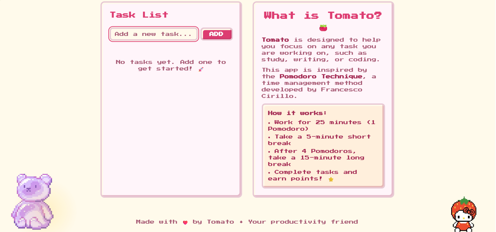

# 🍅 Tomato Productive — Pixel Pomodoro Timer

**Live Demo: https://granxn.github.io/tomato-productive**
**Repository: https://github.com/Granxn/tomato-productive**

---

## ⭐ Project Overview

A cute **pixel-art themed** web app that combines a **Pomodoro Timer** with a simple task list. This project was built to practice core JavaScript logic, DOM manipulation, and data persistence using Local Storage.

---

## ✅ Key Features

- ⏱ **Pomodoro Timer:** Fully functional timer with Pomodoro (25 min), Short Break, and Long Break modes.
- 📝 **Task Management:** Users can add, edit, delete, and mark tasks as complete.
- 💾 **Persistent Data:** All tasks are saved automatically to the browser's **Local Storage**, so your list is always there when you return.
- 🎨 **Cute Pixel Theme:** A friendly, non-distracting pixel art style to make productivity fun.
- ✨ **UI Feedback:** Includes notifications for adding/deleting tasks.

---

## 🛠 Tech Stack

- **JavaScript (ES6+)**
- **HTML5**
- **CSS3**
- **GitHub Pages:** Deployed as a static site.

---

## 💡 Learning Highlight

The core challenge was managing the application's state (timer status, task list) using only vanilla JavaScript and interacting directly with the DOM.

---

## 📸 Screenshots

| Main Timer | Empty Task List |
| :---: | :---: |
|  |  |
| **UI Feedback** | **Tasks in Progress** |
|  |  |
